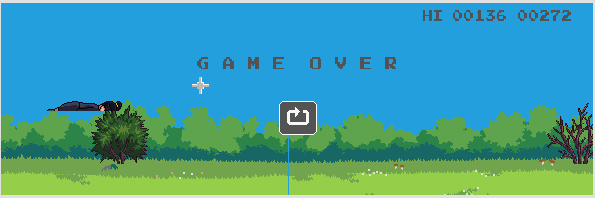

# Samurai X Adventure

<p align='center'>
	
</p>

## Requirements

Use the package manager [pip](https://pip.pypa.io/en/stable/) to install following packages :-
* Pygame

```bash
pip install pygame
```

## Usage

Double click the main.py to open the game. The objective of the game is to dodge incoming obstacle and birds in order to create high score.

Controls:
* Press Space or Up arrow key to jump.
* Press Down arrow key to duck.
* Press space on end page to restart the game.
* Press escape or q key to end the game.